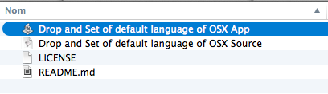
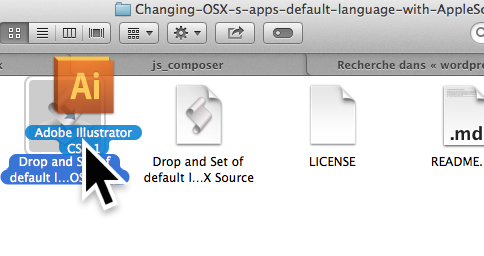
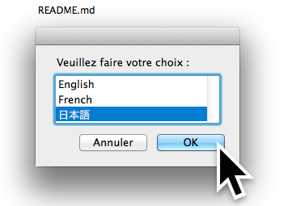
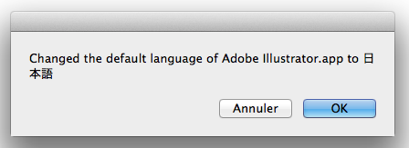

Changing-OSX-s-apps-default-language-with-AppleScript
=====================================================
##How to use

###1. Download the script
Download the repo or the AppleScript Application file. Locate "Drop and Set of default language of OSX App".

###2. Drag and Drop an Application onto the the AppleScript Application

###3. Choose a language

###4. Your app will be launched in the language of your choice

##Introduction

We sometimes need to set a default language of OSX App to something else different from that of System default.
With Adobe products it is essential to do so because Adobe restrict default language by license (if you have a Japanese license for major Adobe products, you can use the software only in the language you have license for. In other terms you cannot use the software in english if you only have a Japanese license for it).

Such occasion happens quite often to me. So I made an AppleScript to make the process faster and easier.
Here is the AppleScript. Tested to work on OSX Mavericks. Save the script as Application in the AppleScript editor. Then drop any application on the AppleScript app.

Homepage : http://befive.info/2014/10/05/changing-osxs-apps-default-language-with-applescript/
